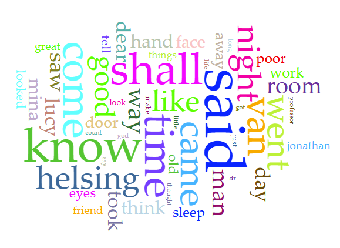
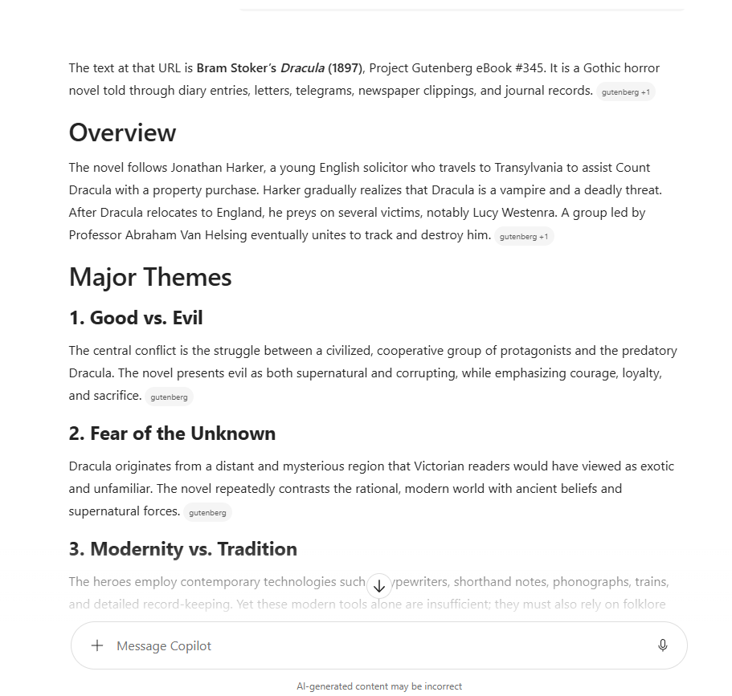



# Distant Reading Assignment 

I used Voyant to search the following website. [Project Gutenberg](https://www.gutenberg.org/cache/epub/345/pg345.txt)

I've never used Voyant before, so I wasn't too certain what I was getting into. It allows the reader to quickly analyze a large amount of text without reading the entire document. It organizes the text into visual patterns and statistics. You can see the most used terms and where certain words appear most frequently. Voyant doesn't identify the intention or tone behind the word choices however.

Take a peak at my results!

I also used Copilot in an attempt to replicate similar findings but was left with results I was more familiar with. Copilot focused less on the word statistics but rather the intentions and plot of the book. It broke the book down into major themes, literary techniques, and narrative structure. The results seem fairly accurate since Copilot had full access to the text. 

Here's a blurb from the conversation:

Here is a fun link to a [Markdown Cheatsheet](https://www.markdownguide.org/cheat-sheet/). Once you grasp the basics here, go add "Markdown" to your list of skills on your resume!
